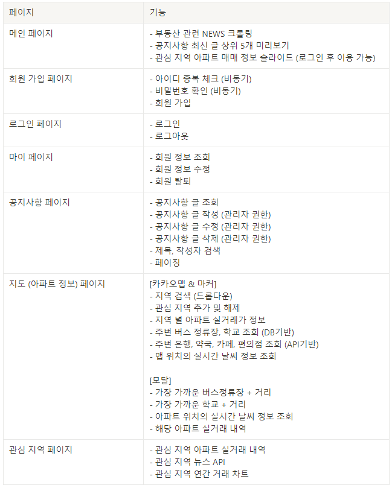

# ssafy-zipchat 🏙
### SSAFY 8기 1학기 최종 관통프로젝트

 

## **개요** ✅
- **국토 교통부 아파트 매매 실거래 자료**를 통해 쉽게 시세를 알 수 있게 해주고 <u>주변 상권 및 시설 위치</u>를 함께 제공, <u>관심 지역</u>을 설정하여 관심 지역의 정보를 추가 제공

 

## 프로젝트 기간 📆
- **2022년 11월 16일 ~ 2022년 11월 24일**

 

## 기술 스택 🛠

  
  
  
  
  
  
  
  
   
  

 

## 팀원 💻
<table>
  <thead>
    <tr>
      <th>이름</th>
      <th>구현 기능</th>
    </tr>
  </thead>
  <tbody>
    <tr>
      <td rowspan="2">이종민</td>
      <td>Back End - 전반</td>
    </tr>
    <tr>
      <td>Front End - Vuex(회원관리, 게시판, 뉴스API, 관심지역, 날씨 API), 차트, 슬라이드</td>
    </tr>
    <tr>
      <td rowspan="2">최희경</td>
      <td>Back End - 아파트 매매 정보, 버스정류장, 학교 데이터 DB 설계 및 REST 구현</td>
    </tr>
    <tr>
      <td>Front End - 전반</td>
    </tr>
  </tbody>
</table>

 

## 기능

 

## 실행 화면

### **🔗메인 페이지**

 ⭕ 메인 화면, 부동산 관려 뉴스 및 공지사항, 관심지역 매물 정보인 3개의 화면으로 메인 페이지 구성
 
 
 

---
### **🔗 회원 정보 관련 페이지**

 ⭕ 회원가입 시 아이디 중복여부 체크, 비밀번호 확인을 통해 추가로 체크
 
 

 ⭕ 회원정보 확인 및 수정, 탈퇴 
 
 
 

---
### **🔗 공지사항 페이지**

 ⭕ 공지사항 페이징 구현, 키워드를 통해 제목, 작성자로 검색 가능
 
 

 ⭕ 관리자만 고지사항 쓰기, 수정, 삭제 가능
 
 
 

---
### **🔗 아파트검색 페이지**
 ⭕ 아파트 검색 페이지
 
 ⭕ 아파트 검색 페이지 + 주변 상권 및 시설 마커
 
 ⭕ 아파트 검색 페이지 + 가장 가까운 버스정류장, 학교를 모달을 통해 보여줌
 
 
 

---
### **🔗 관심지역 페이지**

 ⭕ 관심지역으로 추가된 지역의 매매 정보 리스트
     관심지역의 뉴스 및 연도별 거래 횟수 차트
 
 

 ⭕ 메인 페이지에서 관심지역으로 추가된 지역의 최신 거래내역 3개를 보여줌
 
